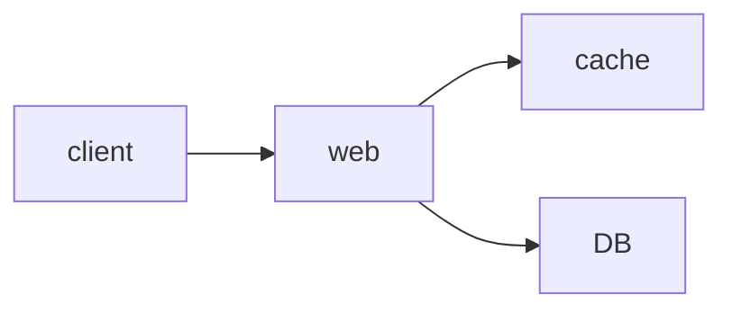
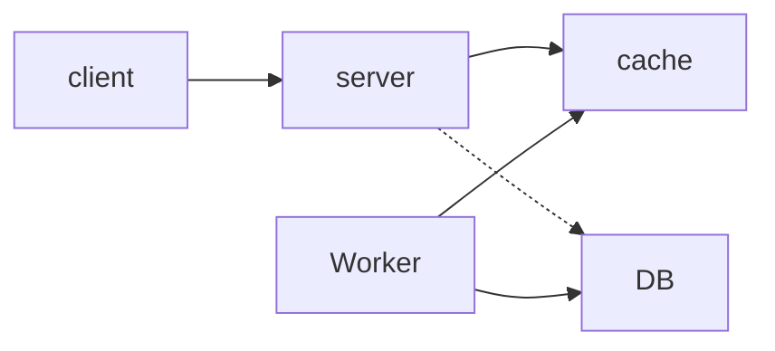
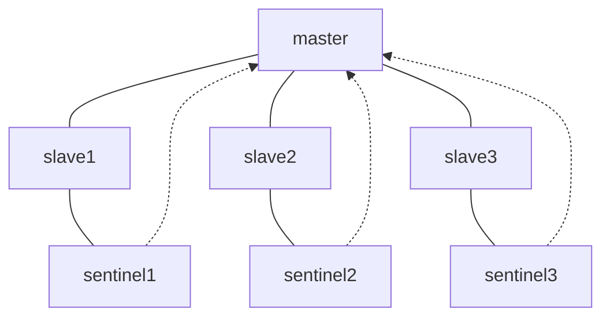
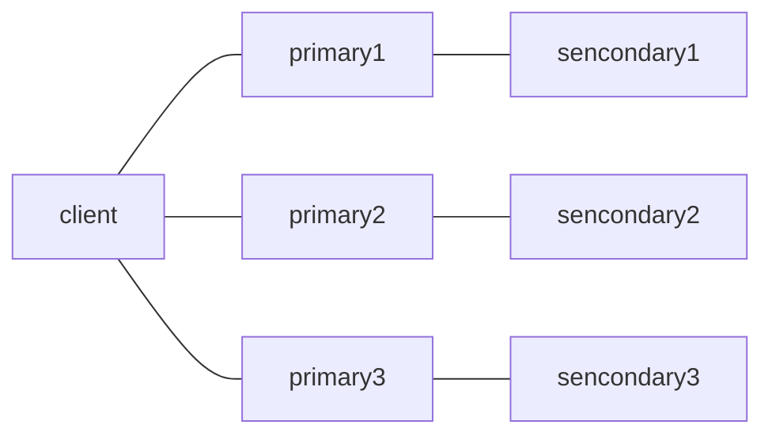

# Redis
---
- Remote dictionary server

> Redis is an open source, in-memory data structure store, used as a database, cache, and message broker
- Redis는 메모리에 저장하는 데이터 구조

> Redis provides data structures such as strings, hashes, lists, sets, sorted sets with range queries, bitmaps, hyperloglogs, geospatial indexes, and streams
- string, hashes, list, set 등 다양한 구조 지원

---
# 캐시
- WEB-WAS-DB 구조의 서비스, 3티어로도 충분
	- 사용자가 늘어나면, DB에 부하가 커짐
	- DB데이터는 물리적으로 저장되기때문에 손실가능성은 낮지만, 트랜젝션마다 디스크에 접근해야 함
- 캐시 : 데이터를 임의의 저장 공간에 저장하여, 빠르게 결과값을 반환할 수 있게 도와주는 구조

---



- 클라이언트의 요청이 있으면 캐시를 먼저 확인하여 DB에 요청하지 않고 반환 `cache hit`
- 캐시에 해당 값이 없어 DB에 요청을 하는 `cache miss`
	- 캐시에 없는 경우에만 DB에 요청하는 Lazy Loading
	- 캐시에 데이터가 없거나 접근할 수 없으면, DB에 접근하면 되므로 Redis에 접근 불가능한 경우에도 장애가 발생하지 않음

---



-  동시다발적 쓰기가 발생하는 경우, Cache에 입력값을 저장한 후, Worker 서버가 DB에 입력하는 작업 시행
	-  캐시의 장애 또는 서버의 다운이 발생하면 데이터 손실될 수 있음

---

# Redis
- key-value 기반 인메모리 데이터 저장소
	- key-value 구조이므로 결과를 바로 가져올 수 있음
	- 디스크에 작성하는게 아니라 메모리에서 처리하기 때문에 빠름
	- 메모리에 저장되는 캐시 방식이므로, 서버 종료 등 상황에서 데이터가 삭제될 수 있음

---

## 데이터 타입
- 다양한 구조 지원
	- string : 키-값 구조
	- list, set, sorted set, hashes
- 데이터 저장뿐만 아니라, 인증 토큰, 랭킹 보드 등으로 사용
- 가장 기본 적으로 string으로 저장되고, bitmap, list, hash, set 등 데이터 타입으로 저장할 수 있음

---

- String 
	- 단순 증감 연산 사용
- Bits
	- 비트 연산으로 값 계산, 데이터 공간 절약
- Lists
	- Message queue로 활용할 수 있음
- Streams
	- 로그 저장

---

## Redis 아키텍처
- Redis를 구성하는 방법은 Replication, Sentinel, Cluster 등

---

### Replication
- Master-Slave 구조
	- Read 분산 및 데이터 이중화
- Master : 쓰기 & 읽기
- Slave : 읽기
- Replication은 Master의 데이터를 복제하여 Slave에 옮기는 작업
- 하나의 Master에 여러 Slave 설정 가능

---

### Sentinel



- Master-Slave구성에 Sentinel 추가
	- Sentinel은 Master 감시, 다운되면 Master로 승격
	- 다운된 Master가 시작되면 Sentinel로 추가
- 무중단 서비스 가능

---

### Cluster



- primary가 다운되면, secondary가 primary로 승격
- slot 단위 데이터 관리로, 데이터 분산 등 문제 해결
- 메모리 사용이 많고, 추가적 구현 필요

---

## Redis 운영 관련
1. 메모리 관리
	- 메모리 할당의 구현에 따라 성능이 달라질 수 있음
	- 메모리 파편화
2. O(N) 명령
	- Redis는 싱글 스레드
	- 초당 10만개 이상의 명령을 수행할  수 있지만, O(N)명령이 주어지면, 다른 작업의 대기시간이 길어지 됨

---

# Redis 응용
- Java, Python, PHP, C, C++, C#, JavaScript, Node.js, Ruby, R, Go를 비롯한 다수의 언어가 지원

---

## Python
- `redis` 라이브러리

```python
import redis
r = redis.StrictRedis(host='localhost', port=6379, db=0)

# 데이터 저장
r.set('foo', 'bar')
# 데이터 가져오기
r.get('foo')
# 데이터 삭제
r.delete('foo')
# redis DB 전체 삭제
r.flushdb()
```

---

## Django
- 4.0 부터 지원

```python
# settings.py
CACHES = {
    'default': {
        'BACKEND': 'django.core.cache.backends.redis.RedisCache',
        'LOCATION': 'redis://127.0.0.1:6379',
    }
}
```

---

- 실제 사용은 django.core.cache.cache를 사용하여, `cache.set()` `cache.get()`을 활용하여 사용할 수 있음
- 거의 대부분의 데이터를 저장 및 활용할 수 있지만, Redis가 지원하는 형태여야 가능
	- `queryset`과 같이 지원하지 않는 데이터타입을 활용하려면, 리스트 또는 딕셔너리를 활용하여 사용할 수 있음

---

# 참조
- [NHN FORWORD 2021 Redis](https://www.youtube.com/watch?v=92NizoBL4uA), [우아한테크세미나](https://www.youtube.com/watch?v=mPB2CZiAkKM), [우아한Tech Reids](https://www.youtube.com/watch?v=Gimv7hroM8A)
- [Redis 정리](https://brunch.co.kr/@jehovah/20), [우테코 영상 정리](https://velog.io/@hyeondev/Redis-%EB%9E%80-%EB%AC%B4%EC%97%87%EC%9D%BC%EA%B9%8C)
- [Python Redis](https://soyoung-new-challenge.tistory.com/117)
- Django Redis
	- [공식 문서](https://docs.djangoproject.com/ko/4.0/topics/cache/#redis-1), [Django Redis](https://velog.io/@may_soouu/django-redis), [Django Redeis, troubleshootingl](https://velog.io/@jiffydev/Django-16.-Django-django-redis)