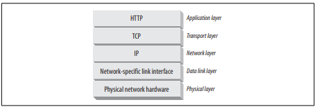
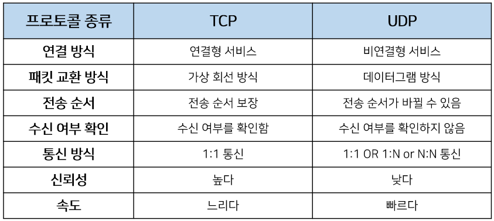

# HTTP

## HTTP(HypterText Transfer Protocol) 란?

- HTTP란 웹 상에서 클라이언트와 서버 간 통신을 위한 프로토콜

- 클라이언트에서 서버로 HTTP request를 보내면 서버에서 클라이언트로 HTTP response를 보내주는 방식으로 통신한다.
- html 파일, jpeg, mpeg 등의 다양한 형식의 파일을 주고 받을 수 있다.
- HTTP는 OSI 7 Layers의 Application Layer의 프로토콜로, Transfer Layer 중 신뢰성을 중시하여 주로, TCP를 통해 전송된다.
- stateless
- connectionless

## Resources

- 모든 종류의 웹 컨텐츠의 source

### MIME type(Multipurpose Internet Mail Extensions)

- MIME 은 본래 서로 다른 이메일 시스템 간 메시지 전송을 위해 설계되었으나, http 에서도 채택되어 멀티미디어 컨텐츠의 타입 표현할 수 있다.

#### 	구조

> type/subtype

- 슬래쉬('/')를 기준으로 원시타입과 서브타입으로 구성되어 표현한다.

- 원시타입은 개별 혹은 멀티파트 타입이 될 수 있다.

​		ex) image/jpeg, text/html ...

### URIs(Uniform Resource Identifier)

- 각각의 resource들은 각자의 이름을 가지고 있고, 이를 통해 client에서 resource에 접근할 수 있다. 이러한 이름을 URI라 한다.
- URI를 통해 resource를 식별할 수 있다.

### URLs(Uniform Resource Locator)

- URL은 가장 일반적인 형태의 resource identfier이다.
- URL은 특정 서버의 resource의 특정 위치를 나타낸다.

### URNs(Uniform Resource Name)

- URN은 Resource의 위치와 관계없이 특정 Resource의 고유한 이름 역할을 한다.

- 실제로 사용시에는 urn:<NID>:<NSS>로 표현된다.

## Transactions

- HTTP의 Transaction 은 request와  response로 구성된다.

### Methods

- HTTP는 methods라는 여러 요청 명령어를 지원한다.
- 모든 HTTP 요청은 methods를 갖는다.

| HTTP method | Description                         |
| ----------- | ----------------------------------- |
| GET         | 특정 리소스를 요청                  |
| HEAD        | 특정 리소스 요청에 대한 헤더를 요청 |
| POST        | 서버로 데이터를 전송                |
| PUT         | 기존 리소스의 데이터를 대체         |
| DELETE      | 특정 리소스를 삭제                  |

OPTIONS - 목표 리소스와의 통신 옵션을 설명 ex) CORS의 preflight

PATCH - 리소스의 부분적인 수정, 멱등성을 가지지 않음

CONNECT - 리소스에 대한 양방향 연결을 시작 ex) SSL

TRACE - request에 대한 loop-back, XST에 취약

https://webhack.dynu.net/?idx=20161111.001

#### 멱등성(Idempotent)

- 동일한 요청을 여러번 보내도 한 번 보내는 것과 같은 효과를 낼 때, 멱등성을 가졌다고 한다.
- 멱등성을 가진 method => GET, HEAD, PUT, DELETE

### Status Codes

- HTTP 요청이 성공적으로 완료되었는지의 여부

| Status Code | Description            |
| ----------- | ---------------------- |
| 1XX         | Informational response |
| 2XX         | Successful             |
| 3XX         | Redirection            |
| 4XX         | Client Error           |
| 5XX         | Server Error           |

## Messages

- ASCII로 인코딩된 텍스트
- 요청 메시지와 응답 메시지의 형태는 유사하다.
- Start Line : 수행할 요청, 발생한 작업에 대한 응답
- Header Field : Colon (':')으로 구분된 이름, 값으로 구성, 빈 줄로 끝남
- Body : 웹 서버/클라이언트에 전달할 데이터

## Connections

### TCP/IP

## Protocol Versions

### HTTP/0.9

- 초창기 버전
- 하나의 메서드, GET
- HTML만 요청 가능

### HTTP/1.0

- 실질적인 첫 버전

- Header, Status Code, Content-Type 추가

### HTTP/1.1

- Persistent Connection : 연속적인 요청 간 연결 유지
- Pipeline : 응답을 기다리지 않고 연속적으로 요청을 보냄
- Head of Line Blocking : 요청 대기 시간이 길어짐
- Header Dulicate : 연속된 요청 간 헤더 중복

### HTTP/2.0

- 헤더 필드 압축, 동일 연결에서 다중 동시 교환 허용 -> 효율적인 리소스 사용, 지연 시간 감소
- 기존 HTTP 표준을 대체하는 것이 아닌 확장 -> 체계, 기능, 개념 유지
- 
- Binary Framing Layer
  - HTTP 메시지의 캡슐화
  - 바이너리 인코딩

#### 스트림, 메시지, 프레임

#### 요청 및 응답 다중화

- 인터리빙 : 프레임 사이에 다른 프레임을 끼워 넣음 -> 프레임의 순서가 상관이 없게 됨
- HOL Blocking 해결, 하나의 연결로 병렬 처리 가능

#### Stream 우선 순위 지정

- 스트림에 우선순위를 두어 프레임 인터리빙을 수행

#### 서버 푸쉬

- 클라이언트가 요청하지 않은 리소스에 대해서 서버가 클라이언트에 푸시하는 것
- 클라이언트가 필요로 하는 리소스들을 서버가 알고 있음

#### 헤더 압축

- HPACK 압축 형식으로 헤더를 압축 => 크기 80% 이상 감소

- 헤더를 Huffman 코드로 인코딩하여 크기를 줄임

  https://http2.tistory.com/1

- 클라이언트와 서버가 이전 헤더 목록을 유지, 업데이트

### QUIC(Quick UDP Internet Connections)

- Transfer Layer의 통신 프로토콜
- UDP 기반이지만 신뢰성을 높이는 방식으로 설계
- TCP로 인해 발생하는 Latency를 줄임

- TCP로 인한 HOL Blocking 문제 해결
- TLS 프로토콜을 사용하여 보안성 강화
- 독립 스트림으로 향상된 다중화 연결 지원

### HTTP/3.0

- QUIC을 사용하는 HTTP

## Architectural Components of the Web

### proxy 

- 클라이언트와 서버 사이의 HTTP 중개자
- 보안이나 데이터 필터링을 위해 사용

### cache 

- 클라이언트 가까이 있는 데이터 저장소

### gateway

- 다른 어플리케이션에 연결하는 웹 서버
- HTTP를 다른 프로토콜로 변환하는 데 주로 사용

### tunnel 

- HTTP 연결을 통해 HTTP가 아닌 데이터를 전송하는데 주로 사용
- SSL 트래픽 전달

### agent

- 사용자를 대신하여 HTTP 요청

# references: 

- David Gourley. HTTP: The Definitive Guide

- https://developer.mozilla.org/ko/docs/Web/HTTP/

- https://developers.google.com/web/fundamentals/performance/http2
- https://devopedia.org/quic

- https://www.youtube.com/c/%EC%9A%B0%EC%95%84%ED%95%9CTech