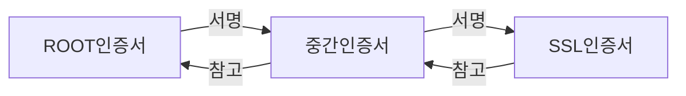

# SSL
- SSL(Secure Socket Layer)
- Netscape에서 웹서버, 브라우저 사이 보안을 위해 만듬
	- 1.0 버전은 공개된 적이 없고, 2.0버전이 1995년, 3.0버전이 1996년 공개
	- 이후 TLS 1.0버전이 1999 공개 후 2018년 TLS 1.3버전까지 개발됨
- [HTTP](HTTP.md)의 보안을 위한 [HTTPS](HTTPS.md)에 사용 

- SSL 아키텍처
	- HTTP프로토콜 상위에 보안을 위한 SSL관련 프로토콜

# SSL 암호화
- 대칭키, 공개키 방식
- 대칭키 : 동일한 키로 암호화와 복호화를 하는 기법
- 공개키 : 공개키로 암호화, 비공개키로 복호화
- [대칭키_비대칭키](보안/대칭키_비대칭키.md)

# SSL 인증서
- 클라이언트와 서버간의 통신을 제 3자가 보증해주는 전자 문서
- 클라이언트가 서버에 접속한 직후, 서버는 클라이언트에게 인증서 정보 전달

## SSL 인증서 역할
- 통신 내용이 공격자에게 노충되는것 방지
- 클라이언트가 접속하려는 서버가 신뢰할 수 있는 서버인지 판단할 수 있음
- 통신 내용의 악의적 변경 방지

## SSL 인증서 내용
- 서비스의 정보, 서버 측 공개키로 분류할 수 있음
	- 서비스의 정보는 접속한 서버가 클라이언트가 의도한 서버가 맞는지에 대한 내용을 담음
	- 서버측 공개키는 CA로부터 인증서를 구입할 때 제출
- 이후 CA에 의해 암호화

## 인증서 종류
- 인증서는 적용되는 도메인 개수, 유효성 검사 수준에 따라 나뉨
- 적용되는 도메인 개수
	- 단일 도메인 : 하나의 도메인에만 적용 가능
	- 와일드 카드 : 다일 도메인에 적용되지만, 해당 도메인의 하위 도메인 포함
	- 멀티 도메인 : 여러 도메인에 적용 가능
- 유효성 검사 수준
	- 도메인 유효선 검사 : 가장 느슨한 수준의 검사, 기업이 도메인을 관리하고 있다는 것 정도만 증명
	- 조직 유효성 검사 : 인증서 발급 시 CA가 기업을 확인하며 증명
	- 확장 유효성 검사 : CA는 조직이 존재하고 법적으로 사업자로 등록되어 있는지, 유효한 주소인지 등을 확인. 가장 시간이 오래 걸리고 비용도 많이 들지만, 가장 높은 신뢰 제공

## CA
- Certificate Authority, 인증기관
- 인증기관은 2계층 혹은 3계층 형태

- google의 SSL 인증서 구조
	- GlobalSign에서 생성한 ROOT CA
	- GTS 중간 인증서
	- google.com의 SSL 인증서
- CA기관 또는 OpenSSL 등을 활용하여 발급받을 수 있음

# SSL 동작

- handshake -> 세션 -> 세션 종료 순서

## handshake
- client, server의 연결
	- client Hello, server Hello
	- 클라이언트가 서버로 연결 시도, 사용가능한 cipher suite 목록, 프로토콜, session id 등 전송
	- 서버에서 클라이언트의 요청에 응답
- server에서 certificate 패킷 전송
	- 서버의 SSL인증서 관련 내용 포함
- client에서 SSL 인증서 검증
	- 클라이언트는 해당 CA를 통해 복호화하고, 이를 통해 검증할 수 있음
- client에서 데이터를 암호화 하는 비밀키 생성
- SSL handshake 종료

# 참조
- [wikipedia SSL](https://ko.wikipedia.org/wiki/%EC%A0%84%EC%86%A1_%EA%B3%84%EC%B8%B5_%EB%B3%B4%EC%95%88)
- [생활코딩 SSL](https://opentutorials.org/course/228/4894)
- [SSL이란](https://12bme.tistory.com/80)
- [CA](https://brunch.co.kr/@sangjinkang/47)
- [handshake](https://nuritech.tistory.com/25)