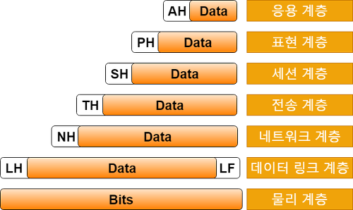

# OSI 7 계층

Date: January 13, 2022

OSI 네트워크 모델(Open Systems Interconnection Reference Model), OSI 7 계층 ***:*** 컴퓨터 네트워크 프로토콜 디자인과 통신을 계층으로 나누어 설명한 것  [출처]([https://ko.wikipedia.org/wiki/OSI_모형](https://ko.wikipedia.org/wiki/OSI_%EB%AA%A8%ED%98%95))

[https://reakwon.tistory.com/59](https://reakwon.tistory.com/59)

1. 물리 계층: 데이터를 전기 신호로 변환. 물리적으로 연결된 두 대의 컴퓨터가 0, 1을 주고 받게 해주는 모듈. - 랜 카드, 리피터, 허브 / 전송 단위- Bit
2. 데이터 링크 계층: 한 컴퓨터-한 컴퓨터 간에 신뢰할 수 있는 데이터 전달.  같은 네트워크에 있는(스위치 하나로 연결된 컴퓨터들) 여러 컴퓨터들 데이터 주고 받음. - 스위치, 브릿지/ 전송 단위: Frame
3. 네트워크 계층: IP 주소를 이용해서 길을 찾고(라우팅), 자기 다음 라우터에게 데이터를 넘겨주어서 목적지 컴퓨터에 데이터 전달. - 라우터, IP 공유기/ 전송 단위: Packet
4. 전송 계층: 신뢰할 수 있는 데이터 전달. (TCP/UDP 프로토콜) / 전송 단위: TCP-Segment, UDP-datagram
5. 세션 계층: 세션 연결하고 없앰. 통신 방식 결정. / 전송 단위 - Data
6. 표현 계층: 인코딩, 압축, 암호화 데이터 변환./ 전송 단위- Data
7. 응용 계층: 애플리케이션에 데이터를 전달. (HTTP/FTP/SMTP 프로토콜)/ 전송 단위- Data

[출처]([https://velog.io/@amuse/OSI-7-Layers](https://velog.io/@amuse/OSI-7-Layers))

[출처]([http://wiki.hash.kr/index.php/파일:OSI_7_계층.jpg](http://wiki.hash.kr/index.php/%ED%8C%8C%EC%9D%BC:OSI_7_%EA%B3%84%EC%B8%B5.jpg))

# 참고 자료

[https://shlee0882.tistory.com/110](https://shlee0882.tistory.com/110)

[https://www.youtube.com/watch?v=BEK354TRgZ8](https://www.youtube.com/watch?v=BEK354TRgZ8)

[https://www.youtube.com/watch?v=1pfTxp25MA8](https://www.youtube.com/watch?v=1pfTxp25MA8)

[https://velog.io/@dyllis/OSI-7계층-정리](https://velog.io/@dyllis/OSI-7%EA%B3%84%EC%B8%B5-%EC%A0%95%EB%A6%AC)

모두의 네트워크(미츠구치 카츠야)