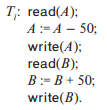
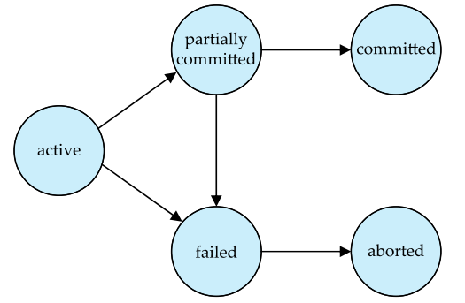

# 트랜잭션(Transaction)

- 트랜잭션이란? 
  - 하나의 논리적 작업 단위를 이루는 연산의 집합
  - 다양한 데이터 항목에 접근하고 갱신하는 프로그램 수행의 단위
  - 한 트랜잭션은 begin transaction과 end transaction 사이에서 실행되는 연산으로 구성
  - 데이터베이스 시스템은 다음의 트랜잭션 성질(ACID 특성)을 지원해야 함

## ACID 특성

- ACID 특성(ACID Property)

  - 원자성(Atomicity) : 트랜잭션의 모든 연산이 정상적으로 수행되거나 아니면 어떠한 연산도 수행되지 않은 원래 상태가 되도록 해야 함
  - 일관성(Consistency) : 고립 상태에서 트랜잭션 수행이 데이터베이스의 일관성을 보존해야 함
  - 고립성(Isolation) : 여러 트랜잭션이 동시에 수행되더라도 각 트랜잭션은 시스템에서 다른 트랜잭션이 동시에 수행되고 있는지를 알지 못해야 함
  - 지속성(Durability) : 트랜잭션이 성공적으로 수행 완료되고 나면, 시스템에 오류가 발생한다고 해도 영구적으로 반영되어야 함

- ACID 특성의 예시

  

  - 계좌 A 에서 계좌 B로 이체하는 트랜잭션
  - 일관성
    - 트랜잭션 전후로 각 계좌의 잔액 합이 변하지 않음
    - 일관성 보장은 프로그래머의 책임
    - 무결성 제약 조건의 자동 검사로 처리
  - 원자성
    - 트랜잭션 도중 오류가 발생하여 비일관성 상태(inconsistent state)가 발생하지 않게 해야 함
    - 데이터베이스의 복구 시스템(recovery system)에서 로그를 이용하여 이전 값으로 복구
  - 지속성
    - 트랜잭션이 성공적으로 종료된 이후에는 모든 갱신 결과가 데이터베이스에 지속됨
    - 복구 시스템이 지속성을 보장함
  - 고립성
    - 여러 트랜잭션이 동시에 수행되면 비일관성 상태가 발생할 수도 있음
    - 트랜잭션을 순차적으로 진행
    - 동시성 제어 시스템(concurrency-control system)을 이용하여 동시에 수행할 수 있게 함

## 원자성과 지속성

- 트랜잭션의 상태

  - 동작(active) : 초기 상태, 트랜잭션이 실행 중인 상태

  - 부분 커밋(partially committed) : 마지막 명령문이 실행된 후의 상태

  - 실패(failed) : 정상적인 실행이 더 진행될 수 없는 상태

  - 중단(aborted) : 트랜잭션이 롤백되고 db가 시작 전 상태로 환원되고 난 상태

    -> 재시작(트랜잭션의 논리적 오류에 의하지 않은 소프트웨어 오류로 인해 중단 되었을 때)

    -> 강제 종료

  - 커밋(committed) : 트랜잭션이 성공적으로 완료된 상태

    - 커밋된 트랜잭션은 취소되지 않음
    - 사용자가 보상 트랜잭션을 수행하여 되돌려야 함

## 고립성

- 트랜잭션의 동시성을 허용할 때의 이점
  - 처리율(throughput), 자원 이용률(utilization) 향상
    - I/O 작업과 CPU 처리가 필요한 작업을 병렬적으로 처리
    - 여러 트랜잭션을 동시에 실행
    - 시스템의 처리율, 디스크, cpu의 이용률 증가
  - 대기 시간 감소
    - 실행 시간이 긴 트랜잭션이 짧은 트랜잭션의 종료를 기다리는 등 트랜잭션 수행의 지연을 줄임
    - 평균 응답 시간(요청부터 완료까지)을 줄임
- 동시성 제어 기법(concurrency-control scheme)
  - 데이터베이스의 일관성을 유지하기 위해 트랜잭션 간의 상호작용을 제어하는 기법
  - 스케줄
    - 시스템에서 실행 중인 트랜잭션들의 순서
    - n! 개의 순차적(serial) 스케줄이 존재
    - 트랜잭션을 동시에 수행하는 경우 비일관성 상태로 만드는 스케줄도 존재
  - 직렬 가능(serializable) 스케줄
    - 순차적으로 수행한 스케줄의 결과와 동일한 결과를 갖는 동시 수행한 스케줄

## 직렬 가능성

- 순차적 스케줄은 일관성 유지를 보장(직렬 가능성을 가짐)
- 충돌 동등(conflict equivalent)
  - 스케줄 S가 충돌이 일어나지 않는 명령어들의 순서를 바꿔서 S'으로 변경된다면 S와 S'이 충돌 동등 하다고 함
  - 모든 직렬 스케줄이 서로 충돌 동등한 것은 아님
- 충돌 직렬 가능성(conflict serializability)
  - 스케줄 S가 한 직렬 스케줄과 충돌 동등하면 충돌 직렬 가능함
  - 우선순위 그래프(precedence graph)를 만들고 위상정렬을 통해 선형 순서를 얻음
  - 우선순위 그래프가 사이클을 가진다면 충돌 직렬 가능 스케줄이 아님
- 뷰 동등(view equivalent)
  - 두 스케줄이 같은 값을 읽고 같은 계산을 수행한다는 것을 보장
- 뷰 직렬 가능성(view serializability)
  - 스케줄 S가 한 직렬 스케줄과 뷰 동등하면 뷰 직렬 가능함
  - 뷰 직렬 가능성을 검사하는 문제는 NP-완전인 것으로 증명되어 잘 쓰이지 않음

## 고립성과 원자성

- 동시 실행을 보장하는 시스템에서 원자성을 보장하기 위해 스케줄 형태에 제한이 필요함
- 복구 가능한 스케줄(recoverable schedule)
  - 모든 트랜잭션 쌍 Ti와 Tj에 대해 Ti가 기록한 데이터 항목을 Tj가 읽었다면 Ti의 커밋 연산이 Tj의 커밋 연산보다 먼저 발생하는 스케줄
- 연쇄적 롤백(cascading rollback)
  - 하나의 트랜잭션의 취소로 인해 다른 트랜잭션들이 연쇄적으로 롤백되는 현상
- 비연쇄적인 스케줄(cascadeless schedule)
  - 모든 트랜잭션 쌍 Ti와 Tj에 대해 Ti에 의해 기록된 데이터를 Tj가 읽기 연산을 실행하기 전에 Ti의 커밋 연산이 먼저 실행되는 스케줄
  - 모든 비연쇄적인 스케줄은 복구 가능한 스케줄

## 고립성 수준

- SQL 표준에 명시된 고립성 수준(isolation level)
  - 직렬 가능(serializable)
    - 직렬 가능한 실행 보장
    - 트랜잭션 코드 작성 시 동시성을 고려하지 않게 해줌
  - 반복 가능한 읽기(repeatable read)
    - 커밋된 레코드만 읽을 수 있음
    - 반복하여 읽을 때 다른 트랜잭션이 레코드를 갱신할 수 없음
  - 커밋된 데이터 읽기(read committed)
    - 커밋된 레코드만 읽을 수 있지만, 반복 가능한 읽기는 요구하지 않음
    - 반복하여 읽을 때 다른 트랜잭션이 레코드를 갱신할 수 있음
  - 커밋되지 않은 데이터 읽기(read uncommitted)
    - 커밋되지 않은 데이터도 읽음
    - SQL에서 허용하는 가장 낮은 수준의 고립성 수준
- 모든 고립성 수준은 더티 쓰기(dirty write)를 허용하지 않음
  - 더티 쓰기 : 아직 종료되지 않은 트랜잭션이 기록한 데이터 항목에 덮어 쓰는 것
- 기본적으로 커밋된 데이터 읽기 수준으로 동작
- 시스템의 성능을 높이기 위해 낮은 고립성 수준 사용

## 고립성 수준의 구현

- 트랜잭션 처리에 적합한 스케줄을 생성하는 동시성 제어 기법
  - 목적 : 충돌, 뷰 직렬 가능, 복구 가능, 비연쇄적임을 보장하면서 높은 수준의 동시성을 제공하는 스케줄 생성
  - 잠금 기법
    - 2단계 잠금 규약
      - 1단계 : 잠금
      - 2단계 : 잠금 해제
    - 공유, 독점적 잠금
      - 공유 : 읽을 때, 여러 트랜잭션이 동시 획득 가능
      - 독점 : 기록할 때, 한번에 한 트랜잭션만 획득 가능
  - 타임스탬프
    - 트랜잭션 실행 시작 시 타임스탬프 부여
    - 읽기 타임스탬프
      - 가장 최근에 읽은 트랜잭션
    - 쓰기 타임스탬프
      - 현재 값을 기록한 트랜잭션
    - 충돌 시 타임스탬프 순으로 접근
  - 다중 버전 동시성 제어 기법
    - 데이터 항목에 대해 한 개 이상의 버전을 유지, 새 버전이 아닌 이전 버전을 읽게 할 수 있음
    - 스냅샷 고립(snapshot isolation)
      - 각 트랜잭션은 자기 자신만의 데이터베이스 버전을 가짐
      - 읽기 전용 트랜잭션은 중단되지 않음
      - 너무 많은 고립성을 제공한다는 문제점을 가짐
- 유령 현상(phantom phenomenon)
  - 같은 트랜잭션이라고 해도 두 번 이상 수행될 때 그 사이에 데이터베이스가 변경되어 각각 다른 데이터를 참조하게 되는 현상

## References

Silberschatz, A., Korth, H. F., SudarChan, S. (2021). Database System Concepts 7th Edition

https://www.db-book.com/slides-dir/PDF-dir/ch17.pdf