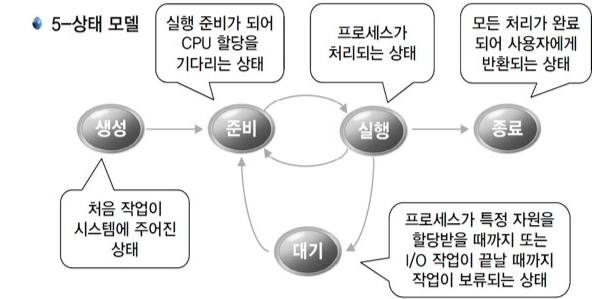
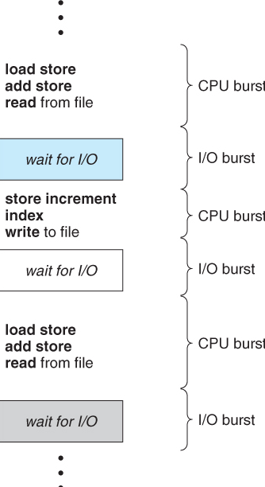
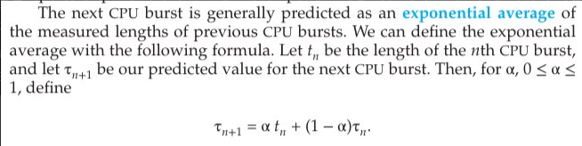
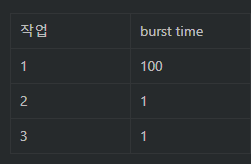
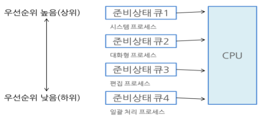
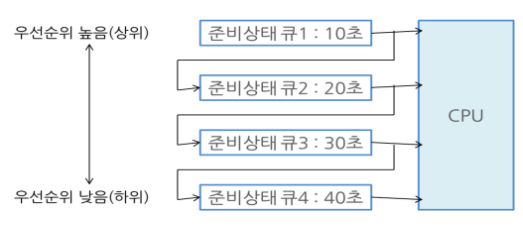

# CPU 스케줄링

## 인트로

[출처](http://jangun.com/study/OperatingSystem.html)

프로세스는 위 다섯 가지 중 하나의 상태로 존재함. 

CPU 스케줄링: 준비(ready) 상태에 있는 프로세스들 중에 어느 프로세스에 cpu를 할당할지 선택하는 것

[출처](https://velog.io/@ssseungzz7/OS-CPU-Scheduling)

CPU burst time: 프로세스가 한번 cpu 잡았을 때 가지고 있는 시간. (I/O 요구할 때까지의 시간)

## CPU 스케줄링의 성능 평가 기준

CPU utilization(CPU 이용율) - cpu 활용 정도.

Throughput(처리량) - 단위 시간 당 완료되는 프로세스 수. 

Turn-around Time(실행부터 종료까지의 시간! 총 처리 시간)- 시스템에 들어가서 작업 끝내고 나올 때까지의 시간. 

Waiting Time(ready queue의 대기시간) - 준비 큐에서 cpu 할당받을 때까지 기다리는 시간. 

Response Time(응답시간) - 준비 큐에서 cpu 얻을 때까지 걸리는 시간. 

=> 균형 있게 해야 함. 어떤 시스템인지에 따라서 기준 달라질 수도. 

## 선점 스케줄링과 비선점 스케줄링

프로세스에 대한 cpu 스케줄링을 언제 결정하는지?

cpu 스케줄링 시점은 프로세스 상태에 따라서 네 가지

1. 실행 → 대기 ( i/o 작업 등)
2. 실행 → 준비 ( 타임 슬라이스 나눠서 작업하는데, 그 타임 슬라이스 끝났을 때)
3. 대기 → 준비 (i/o 작업 끝났을 떄)
4. 종료

비선점형(non-preemptive): 프로세스가 입출력 요구를 받거나 완전히 끝나서 cpu를 자진해서 반납할 때까지 CPU 실행을 보장해주는 스케줄링. (1, 4번)

선점형(preemptive): 프로세스가 작업 중인데, 그걸 그만두게 하고 할 수 있는 스케줄링 (1~4번)

## 스케줄링 알고리즘

###  선입 선처리(FCFS, First Come First Served)

먼저 온 프로세스를 먼저 처리해주는 방식

비선점형

문제점)

응답 시간이 오래 걸릴 수도 있음.

Convoy Effect(호위 효과): CPU 점유시간이 큰 프로세스가 먼저 CPU를 점유하는 경우, 수행 시간이 짧은 프로세스들이 오래 기다림. ⇒  나머지 프로세스들의 대기시간이 덩달아 늘어나는 현상.

[출처](https://www.javatpoint.com/os-convoy-effect-in-fcfs)

### 최단 작업 우선 (SJF, Shortest Job First)

cpu burst time이  짧은 프로세스를 먼저 처리해주는 방식

비선점형

평균 대기 시간에 있어서 최적의 알고리즘

문제점)

다음에 오는 프로세스 cpu burst time을 알 수 없다. 

=> 해결) 과거의 burst time을 통해서 다음 burst time을 예측한다. 지수 평균- 다음 버스트 타임은 이전 버스트 타임의 지수적 평균으로 생각한다고 함. (과거 버스트 타임 가지고 예측한다.)

[출처](https://cs.stackexchange.com/questions/140364/confusion-about-the-definition-of-exponential-average)

---

### FCFS 스케줄링의 호위 효과 예시

FCFS) 1→ 2→ 3

평균 총 처리 시간) (100 + 101 + 102)/3 = 101

평균 대기 시간) (0+100+101)/3 = 67

SJF) 2→3→1

평균 총 처리 시간) (1 + 2 + 102) / 3 = 35

평균 대기 시간) (0+1+2)/3 = 1

---

###  최소 잔류 시간 우선 (SRF=SRTF=SRT, Shortest Remaining Time First)

SJF 스케줄링을 비선점에서 선점 형태로 수정한 스케줄링 알고리즘.

프로세스의 남은 실행 시간이 짧은 순서에 따라서 cpu에 할당함.

새로 도착한 프로세스의 실행 시간이 지금 running하는 프로세스의 남은 실행 시간보다 적다면 강제 교환함.

문제점) SJF 스케줄링과 동일.

### 우선 순위 스케줄링(Priority-based )

각 프로세스에 우선순위를 주고, 우선순위가 높은 프로세스에 CPU를 할당함.

우선순위가 같은 경우는 FCFS로 처리힘.

(SJF는 우선 순위 스케줄링의 한 방식이라고 할 수 있음.)

우선 순위 기준 세우는 것이 중요.

선점형, 비선점형 모두 가능.

문제점) 기아현상(우선 순위가 밀리는 프로세스는 무한정 대기해야 함.)

=> 해결) Aging: 오래 기다린 프로세스에게 우선순위를 높여주는 것.

### 라운드 로빈(RR, Round-Robin)

우선 순위가 같은 프로세스를 번갈아가면서 스케줄링하는 방식.

시분할(time-sharing)과 관련 있음. 프로세스 별로 일정하게 쪼개진 시간(time quantum, time slice)을 할당해줌. (만약 time slice보다 실행 시간이 긴 프로세스가 있다면, time slice까지만 실행하고 넘어감.)

현대 OS에서 기본적으로 사용하는 방식.

선점형.

장점)

반응 시간이 좋음.

프로세스가 대기하는 시간이 공정함.

주의점)

Time slice 시간이 중요함 - 너무 커지면 FCFS와 같아져서 비효율적, 너무 작으면 context switching 많이 발생.

### 다단계 스케줄링(MLQ, Multi Level Queue) 

[출처](http://blog.skby.net/cpu-선점-스케줄링-기법/)

준비 큐 여러 개. 각 큐마다 다른 스케줄링 알고리즘 적용 가능.

우선 순위 높은 큐의 프로세스에 cpu를 할당함.

프로세스는 다른 큐로 이동 불가능.

선점형. 

문제점)

기아 현상(우선 순위 낮은 프로세스가 오랫동안 cpu 할당 기다림) 가능성.

### 다단계 피드백 큐 스케줄링(MFQ, Multi Level Feedback Queue)

[출처](http://blog.skby.net/cpu-선점-스케줄링-기법/)

다단계 큐 + 동적인 프로세스 우선 순위 변화 적용.

프로세스는 다른 큐로 이동 가능.

준비 큐 여러 개. 큐마다 다른 time slice 부여. 낮은 단계일 수록 time slice 증가.

프로세스 생성 시, 가장 높은 우선 순위 준비 큐에 등록. => time slice 끝날 때까지 cpu 차지하고 있으면,  우선 순위 한 단계 낮은 큐에 등록. 

타임 슬라이스 내에 입출력 작업으로 cpu 내놓거나, 오래 대기하면 다시 우선 순위 올려줄 수 있음.

CPU bound 프로세스는 낮은 우선 순위의 큐에, i/o bound 프로세스는 높은 우선 순위 큐에 배치.

마지막 단계 큐는 라운드 로빈/FCFS 방식.

## 참고 자료

[운영체제_CPU 스케줄링](https://m.blog.naver.com/qkrqhtjd0806/222607634472)

[[O/S\] CPU 스케줄링 알고리즘 (CPU Scheduling Algorithm)](https://velog.io/@ss-won/OS-CPU-Scheduling-Algorithm)

[Interview_Question_for_Beginner/OS at master · JaeYeopHan/Interview_Question_for_Beginner](https://github.com/JaeYeopHan/Interview_Question_for_Beginner/tree/master/OS#cpu-스케줄러)

[SSOC 운영체제 입문 강의-CPU 스케줄링](http://ssoc.sogang.ac.kr/lectureview.do?pkid=68)

[[운영체제 OS\] 다단계 큐 스케줄링(MLQ), 다단계 피드백 큐 스케줄링(MFQ)](https://cocoon1787.tistory.com/124)

