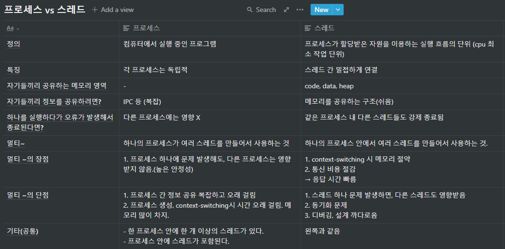

# Process, Thread

### Program

의미

- 파일이 저장 장치(하드 디스크)에 저장되어 있지만 메모리에는 올라가 있지 않은 정적인 상태( (https://velog.io/@raejoonee/프로세스와-스레드의-차이)

- 실행되지 않은 파일 자체
- 코드 덩어리

## Process

### 의미

	- 컴퓨터에서 실행 중인 프로그램(https://terms.naver.com/entry.naver?docId=4383179&cid=59941&categoryId=59941)
	- 메인 메모리에 프로그램이 올라온 것

(이미지 출처: https://sunrint10103.tistory.com/entry/운영체제-프로그램과-프로세스)

### 설명

​	프로세스가 메모리에 올라갈 때, 운영 체제는 프로세스에게 독립한 메모리 영역을 할당해 준다.

(이미지 출처:https://zangzangs.tistory.com/107)

​	프로세스들은 각각 독립된 메모리 영역을 가진다.

(이미지 출처: [Heee's Development Blog](https://gmlwjd9405.github.io/2018/09/14/process-vs-thread.html))

​	프로세스 간 통신 방법 - IPC(Inter-Process Communication)

​	

(표 출처: https://doitnow-man.tistory.com/110)

## Multi-Process

(이미지 출처:https://sumanaki.tistory.com/127)

### context-switching

의미

​	어떤 프로세스를 실행하다가, 다른 프로세스를 실행할 때 기존 프로세스 정보는 PCB(process control block- 프로세스의 메타 데이터를 저장하는 블록. 프로세스 별로 존재함)에 저장하고, 다음 프로세스 정보를 PCB에서 가져오는 작업

(이미지 출처:https://www.crocus.co.kr/1364)

### Multi-Process 특징

단점

 - 프로세스 간 정보 공유가 어렵고 복잡함.
 - 프로세스 생성, context-switching 시 시간 오래 걸림. 메모리 많이 차지함.

장점

	- 프로세스 중 하나에 문제 생겨도, 다른 프로세스에 영향 주지 않음.

## Thread

### 의미

- 프로세스보다 작은 실행 단위

 - cpu 입장에서 최소 작업 단위

### 설명

​	하나의 프로세스는 한 개 이상의 스레드를 가짐.

(이미지 출처- https://selfish-developer.com/entry/프로스세와-스레드)

​	스레드는 한 프로세스 안에서 주소 공간, 자원 대부분을 공유함.

(이미지 출처: [Heee's Development Blog](https://gmlwjd9405.github.io/2018/09/14/process-vs-thread.html))

### 종류

참고) 

(이미지 출처:https://velog.io/@byunji_jump/운영체제-프로세스와-스레드)

1. 사용자 스레드

   운영체제에서 지원하는 스레드 라이브러리를 써서 유저 레벨에서 커널 스레드처럼 쓸 수 있게 해줌

   커널은 사용자 스레드를 인식하지 못함

   커널 수준 스레드 1: 사용자 수준 스레드 다

   

   (출처https://www2.cs.uic.edu/~jbell/CourseNotes/OperatingSystems/4_Threads.html)

   장점

   ​	사용자 영역에서 생성, 관리 -> 속도 빠름

   ​	커널 개입 없음 -> 모든 운영체제에서 실행 가능

   단점

   ​	한 스레드가 중단되면 다른 스레드도 다 중단됨

2. 커널 스레드

   

   (출처:https://www2.cs.uic.edu/~jbell/CourseNotes/OperatingSystems/4_Threads.html)

   운영 체제가 직접 지원함

   커널 수준 스레드 1: 사용자 수준 스레드 1

   장점

   ​	한 스레드가 중단되어도, 다른 스레드는 다른 일을 할 수 있음.

   단점

   ​	메모리를 많이 차지. 생성, 관리 느림.

3. 혼합형

   둘을 혼합한 구조

   대부분 운영체제가 지원함

   

   

   (출처:https://www2.cs.uic.edu/~jbell/CourseNotes/OperatingSystems/4_Threads.html)

## Multi-thread

### 의미

​	하나의 프로세스가 여러 스레드를 만들어서 사용하는 것

​	

(이미지 출처:https://www2.cs.uic.edu/~jbell/CourseNotes/OperatingSystems/4_Threads.html)

### 설명

(이미지 출처:http://www.qnx.com/developers/docs/qnxcar2/index.jsp?topic=%2Fcom.qnx.doc.neutrino.getting_started%2Ftopic%2Fs1_procs_Multiple_threads_single_CPU.html)

-> 병렬 처리(parallelism)

(이미지 출처:http://www.qnx.com/developers/docs/qnxcar2/index.jsp?topic=%2Fcom.qnx.doc.neutrino.getting_started%2Ftopic%2Fs1_procs_Multiple_threads_single_CPU.html)

->  concurrency

### 장점

 - 스레드 생성, 종료 시 시간, 메모리 절약
 - 통신 용이, 응답 시간 빠름
 - context-switching 시 시간, 메모리 절약

### 단점

 - 한 스레드가 다른 스레드에도 영향을 미침
 - 공유하는 메모리가 일관성 있어야 해서, 스레드 간 동기화 필수
 - 까다로운 디버깅과 설계

## 참고

### Multi tasking

의미: 운영체제의 스케줄링에 의해서 작업(task)를 번갈아 가면서 수행하는 것

### Multi Programming

의미: 단일 cpu에 여러 개의 프로그램이 동시에(concurrency) 실행되게 한 것

## process vs  thread 정리

(출처: 내 노션)

## References

https://velog.io/@raejoonee/프로세스와-스레드의-차이

https://gmlwjd9405.github.io/2018/09/14/process-vs-thread.html

https://www.crocus.co.kr/1364

https://velog.io/@chy0428/OS-멀티프로그래밍-멀티프로세싱

https://www.youtube.com/watch?v=1grtWKqTn50

https://luv-n-interest.tistory.com/430

