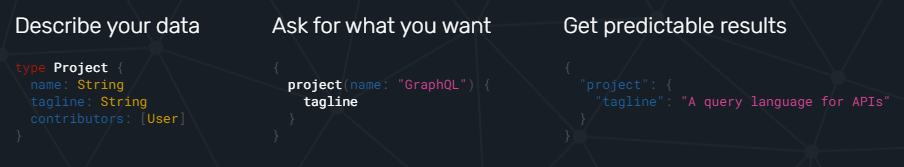

# GraphQL

.png)

## GraphQL 이란?

> A query language for API

- 페이스북에서 개발한 API를 위한 질의어이자 이러한 질의어를 실행하는 서버사이드 런타임
- REST API를 대체하기 위해 개발(2012년 부터, 2015년 첫 배포)
- 선언적 데이터 추출을 가능하게 함 -> 클라이언트가 원하고자 하는 데이터를 특정
- 데이터가 graph 구조를 이루고 있음
- REST API와는 달리 '/graphql'이라는 단 하나의 엔드포인트만 존재
- 모든 요청(CRUD)은 HTTP get, post 요청을 사용
  - post 만 사용한다는 글도 있으나 공식문서에서는 query를 이용하여 get 방식도 사용

- 데이터에 대한 직관적인 설명 제공
- 강력한 개발자 도구 제공
- Underfeching, Overfetching으로 인한 자원 낭비 방지
- GraphQL은 다양한 언어, 프레임워크에 적용할 수 있음

## 등장 배경

1. 모바일 환경의 사용 증가로 효율적인 데이터 로딩이 필요
2. 클라이언트의 프레임워크와 플랫폼의 다양화
3. 급격한 개발한경을 위한 빠른 개발 속도와 결과 예측의 필요성
4. 기존의 REST API는 갑작스런 클라이언트의 요구 사항 변화에 유연하지 못함

## REST vs GraphQL

- REST
  - 다수의 엔드포인트
  - 원하는 데이터를 얻기 위해 여러번 요청

- GraphQL
  - 하나의 쿼리로 필요한 데이터 모두 요청
  - JSON 형식의 응답

## Overfetching and Underfetching

- 기존 REST API가 갖는 문제점
- Overfetching
  - 클라이언트가 요구하는 데이터 외 불필요한 데이터까지 제공
- Underfetching
  - 하나의 엔드포인트가 클라이언트가 요구하는 데이터를 충분히 제공하지 못함

## 그래서 왜 GraphQL을 사용해야 하는가?

- 요구사항 변화에 유연한 대처 가능
  - 백엔드 변화가 적어짐
- graphQL을 통한 API 모니터링 가능
  - swagger와 같은 문서화 불필요
- 스키마, 타입 정의의 이점
  - 강력한 타입 시스템 제공

## 용어

- 클라이언트

  - Query
    - 데이터 추출(R)

  - Mutation
    - 데이터 수정(CUD)

- 서버

  - Resolver
    - 서버 측에서 데이터를 변경하는 함수

  - Schema
    - Query, Mutation, Data에 대해 정의

## 예시

- 서버

  - 스키마 정의

    - Data model

    - Query

    - Mutation

  - Query, Mutation 작성
    - Resolver

- 클라이언트

  - Query로 데이터 추출
  - Mutation으로 데이터 변환

## References

https://graphql.org/

https://www.howtographql.com/ - graphQL 무료 강의

https://www.prisma.io/blog/top-5-reasons-to-use-graphql-b60cfa683511 - graphQL을 사용해야 하는 이유!

https://www.huskyhoochu.com/graphql-basic/

https://velog.io/@jangwonyoon/1.-GraphQL-%EA%B0%9C%EB%85%90

