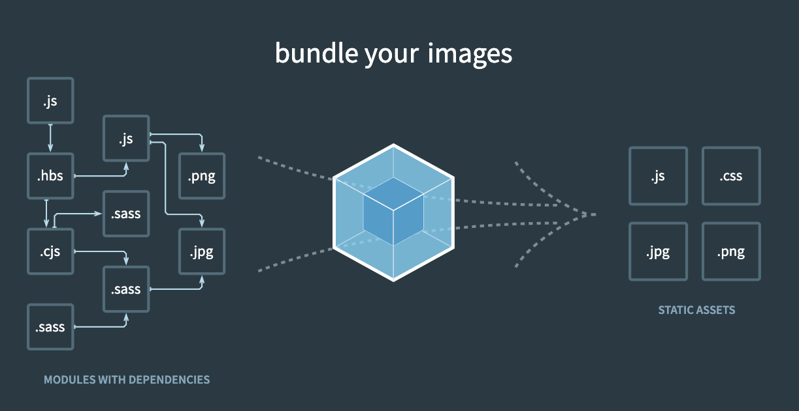

# 모듈 번들러 (module bundler)

## 모듈이란?

- 분리된 코드의 조각
- 시스템을 이루는 논리적인 일부분

## 자바스크립트의 용도

- 웹 페이지에 보조적인 기능을 부여하기 위한 용도
- 웹 페이지에서 자바스크립트를 사용하기 위해서는 아래와 같이 스크립트 태그를 통해 자바스크립트 파일을 가져옴

```html
<script type="text/javascript" src="index.js"></script>
```

- 만약, 필요한 자바스크립트 파일이 2개라면?
- 스크립트 태그를 하나 더 추가하면 됨

```html
<script type="text/javascript" src="index.js"></script>
<script type="text/javascript" src="todo.js"></script>
```

- 하지만, 다음과 같이 두 파일에 서로 같은 이름의 변수가 선언되어 있다면?

```js
// index.js
var todo = "Problem Solving";
```

```js
// todo.js
var todo = "Sleeping";
```

- 처음 index.js 파일을 읽을 땐, `"Problem Solving"` 그리고 `todo.js` 파일을 읽는 순간 `"Sleeping"` 으로 값이 덮어씌워짐
- 이러한 방법으로 자바스크립트 파일을 불러오는 것은 하나의 파일에 모든 코드를 작성하는것과 동일함
- 게다가 이러한 전역 변수는 사용되었기 때문에 전역 스코프를 오염시킴
- 그래서 아래의 코드와 같이, 클로저의 원리를 이용하여 즉시실행 함수 등을 통해 구현한 모듈 패턴으로 외부로부터 독립적인 스코프를 만들어 사용하며 어느정도 해소되는 것처럼 보였지만…

```js
var todoApp = (function () {
  var todo = "꿀잠자기";

  return {
    getTodo: function () {
      return todo;
    },
  };
})();

console.log(todo.getTodo()); // "꿀잠자기"
console.log(todo); // ReferenceError: todo is not defined
```

## Node.js 의 등장

- 자바스크립트를 브라우저내 뿐만 아니라, Java나 Python같이 범용적인 언어로 사용하고자 하는 움직임이 나타남 (i.e. 특히 서버사이드)
- 하지만 이를 위해서는 서로 호환되는 표준 라이브러리나 다른 모듈을 가져오는 표준 방법 등이 필요함
- 이러한 문제의 핵심은 “모듈화”에 있었음
- 모듈화를 위해서는 스코프, 정의, 사용 이 세가지가 필요함
- 각각의 모듈은 독립적인 스코프를 가져야 하며, 모듈을 정의 즉 만들수 있어야 하고, 정의된 모듈을 가져다 사용할 수 있어야 함
- 그래서 2009년 CommonJS가 등장함
- CommonJS는 각각의 파일이 독립적인 스코프를 가짐
- `module.exports`를 통해 모듈을 정의하고, `require` 문법을 통해 정의된 모듈을 가져다 사용

```js
module.exports;

require("./file.js");
```

- CommonJS는 모든 파일이 로컬에 존재하여 바로 불러올 수 있음을 전제로 하며, 동기적으로 동작한다는 특징이 있음
- 브라우저 내의 실행에 중점을 둔 비동기 모듈을 사용하고 싶다면?
- 그래서 비동기로 모듈을 사용하고 싶은 그룹이 독립해 나온것이
- AMD (Asynchronous Module Definition)

```js
define(id?, dependendies?, factory);

require([modulePath], function(module)(){
    // module을 활용하는 실제 코드
});
```

## ES6 (ECMAScript 2015) 의 등장

- ESM (ES Module) 사용

```js
export default App;
---
import App from './App.js';
```

- `html`의 `script` 태그의 `type` 속성에 `module` 값을 넣으면 ESM 문법으로 모듈을 사용할 수 있고, 모듈로서 동작한다

```html
<script type="module" src="./index.js"></script>
```

## 문제점 : 네트워크 통신

- 모듈의 모든 파일을 네트워크 통신을 통해 가져와야 함
- 파일을 하나하나 요청 → 요청 횟수 증가 → 네트워크 비용 증가 → 페이지 로딩 시간 증가 → 나쁜 사용자 경험
- 개발 편의를 위한 모듈의 분리 + 빠른 페이지 로딩 (좋은 사용자 경험)
- 두 가지 모두 만족시킬 수 있는 방법은?
- 답은 서버로의 요청 횟수를 줄이는 것
  - 개발은 모듈로 분리해서 하고, 배포는 하나의 파일로 묶어서(번들링) 해보자

## 모듈 번들러의 등장



- 엔트리 포인트를 시작으로 연결되어 있는 모든 모듈을 하나로 합쳐서 결과물을 만든다
- 자바스크립트 파일 뿐만 아니라, 웹 자원(HTML, CSS, image, font) 까지 모듈로 제공
- 엔트리(Entry), 아웃풋(Output)
  - 하나의 시작점(entry point)으로부터 의존적인 모듈을 모두 찾아내서 하나의 결과물을 만들어 냄
  - `--mode` : 웹팩의 실행모드를 의미, 개발 또는 프로덕션
  - `--entry` : 모듈이 시작되는 부분, 시작점 경로를 지정
  - `--output` : 번들링된 파일들을 저장할 위치, 일반적으로 `dist`, `build`라는 이름의 폴더를 사용
- 로더(Loader)
  - 자바스크립트 파일 뿐만 아니라 웹 자원(HTML, CSS, image, font)들을 변환할 수 있도록 하는 것
- 플러그인(Plugin)
  - 추가적인 기능 제공, 해당 결과물의 형태를 바꾸는 역할
    - 번들된 자바스크립트 난독화
    - 특정 테스트 추출
- 명령어를 통한 webpack 명령어 사용

```bash
$ npx webpack --entry ./src/index.js --output-path ./dist --mode development
```

- 설정 파일을 통핸 webpack 사용

```js
// webpack.config.js

const path = require("path");

module.exports = {
  mode: "production", // or 'development'
  entry: "./src/index.js",
  output: {
    path: path.resolve(__dirname, "dist"),
    filename: "bundle.js",
  },
};
```

```bash
$ npx webpack
```
