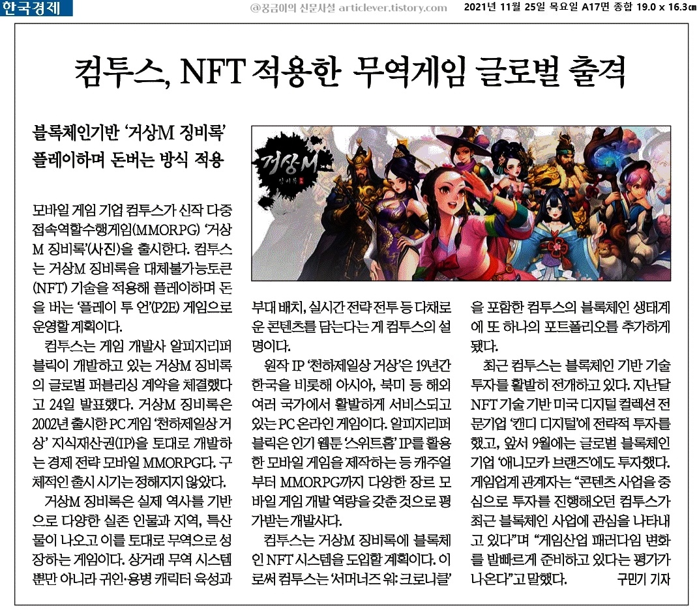
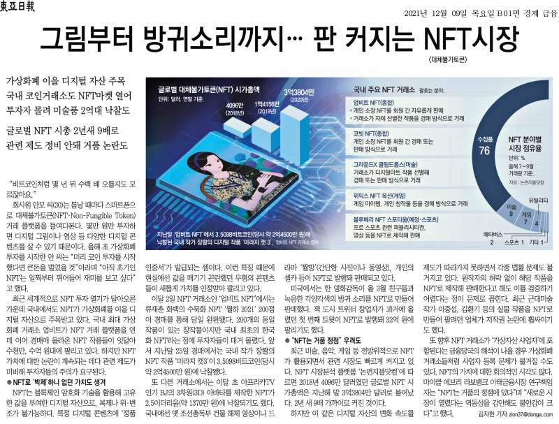

   
  <h1>NFT(Non-Fungible Token)</h1>
   

## 목차

1. [**NFT란?**](#1)
2. [**NFT 특징**](#2)
3. [**NFT 장단점**](#3)
4. [**활용 분석**](#4)
5. [**참조**](#5)

## 1. NFT란?

**NFT(Non-Fungible Token)**란 대체 불가능 토큰으로 블록체인 기술을 이용해서 디지털 자산의 소유주를 증명하는 가상의 토큰(token)으로, 그림·영상 등의 디지털 파일이나 자산에 복제 및 위조가 불가능한 암호를 증명서로 붙임으로써 그 고유한 원본성 및 소유권을 나타내는 용도로 사용된다.

대체 불가능한 토큰 (NFT)은 블록 체인에 저장된 데이터 단위이다. NFT는 암호화 토큰처럼 작동하지만 비트코인과 같은 암호 화폐와는 달리 상호 교환이 불가능하다. NFT의 암호화 트랜잭션 프로세스는 NFT 소유권을 추적하는 데 사용되는 디지털 서명을 제공하여 각 디지털 파일의 인증을 보장한다. 그러나 예술품이 저장된 위치와 같은 세부 정보를 뜻하는 데이터 링크는 사라질 수 있다. 또한 NFT의 소유권은 디지털 자산에 대한 저작권을 부여하지 않는다. 누군가 자신의 작품의 NFT를 판매할 수 있지만, NFT의 소유권이 변경될 때 구매자가 반드시 저작권 권한을 얻지 못하므로 원래 소유자는 동일한 작품에 더 많은 NFT를 만들 수 있다. 그런 의미에서 NFT는 저작권과 분리된 소유권 증명일 뿐이다.

## 2. NFT 특징

 

 기존의 파일들은 데이터로만 이루어져 있었기 때문에 쉽게 무단복제가 가능했으며, DRM을 이용한 복제 방지 기술 또한 결국 이를 유통하는 중앙화된 관리서버가 존재했기 때문에 엄밀히 말해 완전히 독립된 개인의 소유라고 보기에는 어려운 점이 있었다. 

 이와 대조적으로 NFT는 블록체인 기술을 이용해 누구의 통제도 받지 않으며 복제 불가능한 고유성을 가지고 있기 때문에 희소성을 온전히 인정받을 수 있으며, 상대적으로 훨씬 안전하다는 차이점이 있다. 이로 인해 각종 예술품들을 위시한 다양한 디지털 자산들이 NFT로 생산되고 거래가 이루어지기 시작하는 중이다. 거래는 일반적으로 NFT 플랫폼에서 암호화폐인 이더리움을 이용한 경매형식으로 이루어진다. 

 NFT로 꼬리표가 붙은 디지털 자산들은 작품의 소유자와 거래 이력이 블록체인 기술로 기록되며 기술의 특성상 누군가가 이를 함부로 변경하거나 할 수 없다. 동일한 디지털 파일을 NFT로 중복해서 만들더라도, 결국엔 기존의 NFT와는 다른 NFT를 꼬리표로 붙이는 것이기 때문에 먼저 NFT로 생성된 진품과 구별된다. 만약 NFT가 예술계에서 가치를 인정받는 미래가 온다면 당연히 생성된 지 오래된 NFT의 가치가 크게 상승할 것이 뻔하기 때문에 2021년 현재에는 투기나 다름없는 거래가 이루어지고 있다. 

다만 NFT의 현재 주로 사용되는 의미가 디지털 자산과 그를 증명하는 토큰이라는 것이지, NFT 자체는 대체 불가능한 토큰이라는 의미다. 예를 들어 1개의 비트코인은 또 다른 1개의 비트코인과 서로 같은 가치로 대체가 가능한 토큰(Fungible Token;FT)지만, NFT는 하나 하나가 서로 대체 불가능한 토큰이기 때문에 예술 작품에 활용되는 것일 뿐이다. 굳이 예술 작품 이외에도 각종 게임의 아이템에 NFT를 적용하거나 한정판의 유통 등에도 사용될 수 있다.

## 3. NFT 장단점

### - 장점

- **생산의 용이성**
  기존의 예술작품이 진품으로 인정받으려면 상당한 비용과 시간이 소모되었고 이후에도 진품 논란이 생기는 등 그 과정이 굉장히 복잡했지만, NFT는 매우 간단한 컴퓨터 작업만으로도 확고한 진품 증명 토큰을 생산할 수 있다. 만약 실존하는 예술작품을 NFT 로 만들고 싶다면, 디지털 카메라로 찍거나 3D 스캔을 사용하여 디지털 파일을 생성한 후 NFT 를 붙이면 된다.

- **휴대성**
  실존하는 예술 작품들을 보관하려면 온도, 습도, 채광량에 주기적인 관리까지 그 비용과 공간이 필요하지만 NFT는 결국 디지털 파일이기 때문에 흔히 사용하는 가정집의 저장장치에 보관해도 전혀 품질이 변하지 않는다. 일반 디지털 파일로만 구성된 작품이라면 무단 복제나 해킹 등 외부 공격에 대한 대책이 필요하지만 NFT는 이마저도 필요 없다.

- **거래의 자유로움**
  고가의 예술 작품을 거래하려면 기존의 예술품 거래 전문 기업이나 협회의 서비스를 이용해야 했고 그로 인한 수수료도 상당히 부담이 됐지만, NFT는 식별 및 구별 방법이 너무 명확하기 때문에 부담이 거의 없는 수준이다. 개인간에도 인터넷 전송을 통해 거리와 시간의 제약을 받지 않기 때문에 더욱 거래하기가 쉽다.

- **희소성**
  디지털 파일임에도 불구하고 희소성이 생긴다는 가장 큰 장점이 있다. 가령 사진의 경우 인터넷에 한번이라도 올리면 다른 사람들이 구글이나 페이스북을 통해 무단으로 도용할 수 있다. 게다가 디지털이라서 실체가 없기 때문에 현실의 작품과 달리 그냥 카피하면 끝이라서 희소성이 매우 떨어지기에, 특정 매체가 아니면 인쇄해서 작품으로 파는 경우가 대부분이다. 하지만 NFT를 사용하면 '제작 당시의 최초로서 단 하나의 정품 인식코드'라는 분명한 희소성이 생기기 때문에 무단 복제물에 비해 가치를 인정받을 수 있다. 그리고 NFT 역시 디지털이기 때문에 원본 파일에 내장시키기 쉽다는 장점도 있다.

### - 단점

- **유명무실한 증명서**
  암호화폐 가치 논란과 마찬가지로 단순히 꼬리표만 붙인 디지털 파일일 뿐인데 꼬리표만으로 가치가 어마어마하게 상승하는 것에 회의적인 시선이 존재한다. 본체인 이미지나 영상 파일은 단순한 파일에 불과하기 때문에 복붙하면 겉보기엔 똑같은 진품이 하나 더 만들어지는 꼴이라서, 정품이나 프리미엄에 크게 가치를 두지 않는 사람들에게는 큰 의미를 갖지 못한다. 또한 의도나 NFT와 상관없이 복제해서 소장하고 있는 사람들에 대해서는 어떻게 대처할 것인지도 모호하다. 즉 NFT까지 가기 이전에 '디지털 예술 및 프리미엄'이라는 개념부터가 크게 와닿지 않아서 생기는 혼란이라고 볼 수 있다.

- **기술적 문제에 따른 잠재 위험**
  암호화폐와 비슷한 태생적인 불안 요소로, 양자컴퓨터가 개발되는 식으로 NFT를 복제 내지 변조하는 식으로 진품의 인증이 무력화된다면 가치를 잃게 된다. 물론 현대 기준으로는 아직 먼 미래이고, 그런 컴퓨팅 자원이 있으면 차라리 국가나 다국적 기업의 정보망을 공격하는 게 더욱 이득이기 때문에 가능성 수준에 그치는 단점이다.

- **대중 이해도와 진입장벽**
  유명한 사람은 더 유명해진다고 할 수 있을 정도로 입문 난도가 높다. NFT는 결국 유명한 사람들이 제작 및 배포한 작품들을 거액에 구입하는 명품에 가까워서, 일반인이나 무명 작가들이 사용했다간 초기 투자 단계에서 손해를 보기 쉽다. 그렇다보니 과거 1980년대 일본 거품경제 시절처럼 작품 본연의 가치보다는 '유명하니까 구입해서 유명해지고 싶어한다'는 비판도 많다. 멀리 갈 것도 없이 우리나라에서도 NFT 수익 창출 관련 뉴스를 보면 유명인의 비중이 높다. 괜히 JYP를 비롯한 대형 연예기획사들이 우후죽순 NFT 사업에 뛰어드는 게 아니다.

- **정립되지 않은 체계와 NFT의 난립**
  NFT는 기술만 있다면 누구나 만들어낼 수 있기 때문에 돈이 된다 싶으면 어마어마한 수의 NFT가 쏟아져 나올 것은 불 보듯 뻔하고, 바로 위의 '높은 진입장벽'과 엮여서 개인이 만들기보단 업체가 제공하는 서비스가 될 가능성이 높다. 하지만 그렇기에 NFT를 제공하는 서비스 자체의 신뢰도가 문제가 될 수 있고, 이는 본문에서 계속 같이 나왔던 암호화폐도 현재진행형으로 겪고 있는 문제다.누군가가 사용해야 가치가 생긴다며 수요와 공급을 거론하는 건 너무 낙관적이고 방임하는 태도라고 볼 수 있다.

- **도용 NFT 생성 문제**
  특허는 선출원주의를 따르더라도 어느 정도의 검증 절차가 있고 관련 업체 및 단체가 많아서 원 저작자를 가리기가 쉽지만, 이 쪽은 대중들이 자세히 모르는 분야이기 때문에 이해하고 검증하는 데 많은 시간이 소모되며, 정보의 격차가 발생한다. 이 점을 악용해 타인의 작품을 가지고 무단으로 NFT를 만드는 걸 방지할 방법이 현재는 없다. 현재 플랫폼들에 올라온 NFT 중에는 이전에 인터넷에 올라와 있던 작품을 자체적으로 NFT화시키고 등재하여 자신이 원작자라고 주장하는 사례가 꽤 많고, 이런 짓을 전문으로 하는 악질들도 존재할 정도이다. 이를 해결하기 위해 신고 기능을 적용한 플랫폼도 많으나, 현재로선 도용을 원천적으로 예방할 방법이 턱없이 부족하다. 쉽게 얘기하면, 남의 물건을 훔쳐서(장물) 포장해 팔아 먹어도 다른 사람은 그 포장을 풀 수 없기 때문에(=NFT암호가 없기 때문에) 구매자가 신고하지 않는다면 장물인지 아닌지를 구분할 방법이 없다. 같은 이유로, 위조한 것이라도 그것이 진짜인지 알 수가 없다.

- **저작권 독점이 아닌 소유권 취득이라는 한계**
  현실의 작품 또한 소유권을 취득한다고 해서 저작권까지 취득하게 되는 것은 아니나, 문제는 현실의 작품은 유형물로서 소장자 이외의 사람이 사본을 복제하기 까다로운 반면 디지털 자료는 사본을 복제하고 소유하기 쉽다는 차이가 있으며, 여기에서 딜레마가 발생한다.
  명화를 예로 들면, 현실의 명화는 원저작자조차도 자신의 그림을 완벽히 복제하는 게 불가능하기 때문에 원본만의 가치가 있고, 이 '희소성(희귀성)' 때문에 작품의 저작권보다 소유권의 가치가 더 높다. 한편 디지털 작품은 원본과 거의 차이 없이, 이론상 무한히 복제할 수 있다. 즉 디지털 세계에서는 원본의 희소성이 낮은데다 원본이건 복제본이건 가치가 거의 비슷하기 때문에, 소유권보다는 독점적으로 복제할 권한이 있는 저작권의 가치가 더 높다.
  여기서 NFT는 '여러 사본 가운데 원본을 골라 가치를 증명하는' 기능을 하지만, 그렇게 증명된 가치가 사본과 구별되는 실재적・내재적 가치를 반드시 지닌다고 하기는 어렵다. NFT로 만든 원본 증명서는 말 그대로 '원본 증명'일 뿐 저작권과는 별개이다. 즉 NFT를 사서 원본을 소유했다고 증명할 수는 있어도, 그 원본을 독점적으로 복제할 권한은 없다. 이 상태에서 원작자가 원본을, 혹은 불법 복제자가 원본과 필적하는 사본을 대량으로 복제해서 유통한다면? 원본의 가치를 수직으로 하락할 것이다. 즉 NFT 거래 이후에는 저작권 거래가 불가능하다는 식의 법적, 제도적 보완이 반드시 수반되어야 현실의 미술품 거래와 같은 의미가 될 수 있음을 의미한다. 더 나아가 이는 NFT에 대해 전세계적인 기준이 있어야만 시중에서 사용될 수 있다는 점도 시사하고 있다.
  대표적 예시인 Nyan Cat만 하더라도 NFT가 실제로 거래되었지만 독점적 사용권은 얻지 못하였다. Nyan Cat 원작자인 PRguitarman가 Nyan Cat NFT를 A에게 팔고, 저작권을 B라는 사람에게 판매한다고 하자. 저작권을 구매한 B가 독점적 사용을 요구하며 자신의 유튜브에 올린다면 Nyan Cat NFT 소유자는 원본을 가지고 있음에도 자신이 가진 원본의 사적 이용 이외에는 Nyan Cat에 대해 어떠한 저작권도 주장할 수 없다.

- **환경 파괴 문제**
  여러 블록체인 기술들처럼 전기를 과하게 잡아먹는데, 그 중에서도 꽤 심각한 측면에 속한다. 현재 대부분의 NFT는 이더리움 기반으로 운영되는데, 여기에서 쓰이는 작업 증명 방식의 과정에서 막대한 전력이 사용된다. 이더리움 거래의 평균 전력 소모량이 48.14킬로와트라는 것을 생각하면 하루에도 수천 개씩 올라오는 NFT는 탄소발자국의 우려를 불러 일으킨다.
  이 때문에 서양 일러스트 커뮤니티에서는 ~~코인충의 끝판왕~~ 환경 오염의 주범으로 낙인이 찍혀버렸다. 지금 이더리움은 PoW에서 PoS 방식으로 전환하는 과정에 있고, 일부 NFT플랫폼은 비판을 받아들여 에너지를 덜 사용하는 블록체인을 기반으로 운영되는 등 이미지를 개선하려는 움직임은 있지만, 현재로서는 지구 온난화를 일으키는 기술로 인식되어 커뮤니티들에서는 부정적인 인식이 강한 상태.

 

## 4. 활용 분야

 

#### 디지털 아트 

 구매 이후, 소유권을 얻지 못함에도 불구하고 디지털 아트는 서명 과 소유권을 보장하는 블록 체인 기술의 능력 때문에 NFT의 초기 사용 사례였다. "크로스로드"라는 제목의 작품은 도널드 J. 트럼프의 모습을 보여주는 10 초짜리 에니메이션 비디오로 구성되어 있다. 이는 디지털 아트를위한 온라인 암호 화폐 시장 Nifty Gateway에서 660 만 달러에 판매되었다. 

 2021년 11월 글로벌 NFT플랫폼 Dangdang은 한국의 아티스트와 셀러브리티 시장을 대상으로 디지털아트 큐레이션및 매니지먼트 서비스를 시작했다. 아티스트 Krista Kim이 만든 3D 렌더링 모델이 NFT 시장에서 50만 달러 이상의 금액과 함께 디지털 부동산으로 판매되었다. 

#### 수집품 

 NFT는 카드 컬렉션과 같은 수집품 형태로도 나타난다. 2021년 2월 NBA Top Shot 플랫폼에서 LeBron James 슬램 덩크 NFT 카드가 $ 208,000에 판매되었다. 2021년 5월 NBA Top Shot은 백만 명의 사용자가 이용했다. 

#### 게임 내 재화 

 NFT는 게임 개발자 대신 사용자가 제어하는 디지털 플롯과 같은 게임 내 자산을 나타내는 데 사용할 수 있다. NFT를 사용하면 개발자 허용 없이 자산을 타사 마켓 플레이스에서 거래 할 수 있다. 2021년 2월 Axie Infinity 는 단일 판매로 150 만 달러의 판매 기록을 세웠다. 

#### 음악

 블록 체인이 네트워크화가 가능해지면서, 음악가는 자신의 작품을 토큰화하고 게시할 수 있는 기회를 얻었다. 이를 통해 음악가와 아티스트 모두 자신의 음악은 물론 음악 테마와 아티스트 공개를 둘러싼 기타 콘텐츠로 수익을 창출 할 수 있는 방법이 다양해졌다. 또한 NFT는 음악계에서 2020 COVID-19 유행병으로 인해 85% 정도 손실 된 소득을 아티스트와 뮤지션에게 회복 할 수 있게 해줬다. 한정판 상품 또는 아티스트 작품의 실제 사본을 NFT 화해서 팬이 좋아하는 밴드 또는 아티스트와 연결되고 지원할 수 있도록 했다. 

 NFT는 2021년 음악 산업에 큰 영향을 미쳤다. 2021년 2월에만 NFT는 음악 산업 내에서 약 2,500만 달러의 수익을 거두었다. 이는 더 많은 아티스트가 매체에서 벤처를 늘리도록했다. 2021년 2월 28일, 일렉트로닉 댄스 뮤지션 3LAU 는 자신의 Ultraviolet 앨범 3 주년을 기념하기 위해 총 33개의 NFT 컬렉션을 1170만 달러에 판매했다. 

 2021년 5 월, 래퍼 XXXTentacion는 5 곡을 발표 할 것이라고 말했다. 과거에는 2017년 투어에서 NFT 컬렉션으로 영상을 공개했습니다. 다가오는 릴리스는 작곡가를 사후 NFT로 발표한 첫 번째 아티스가 되었다. 

#### 필름 

영화 산업은 일반적으로 크기가 큰 디지털 영화를 작은 파일 크기 용인 블록 체인 기술에 저장하는 기술적인 문제 때문에 NFT의 사업에 참여하는 속도가 느렸다. 

2018년 5월, 20th Century Fox는 Atom Tickets와 파트너십을 맺고 영화 홍보를 위해 한정판 Deadpool 2 디지털 포스터를 발표했습니다. 

2021년 3월, Adam Benzine 의 오스카상 후보 다큐멘터리 Claude Lanzmann : Specters of the Shoah 는 NFT로 제작되고 팔린 최초의 영화였다. 이는 다큐멘터리 부문 아카데미 상 후보 영화가 되었다. 

#### 스포츠 

 스포츠계에서는 다양한 방식으로 NFT를 활용했다. 2019년 9월 NBA 선수 Spencer Dinwiddie 는 다른 사람들이 투자 가능하도록 계약 자체를 토큰화했다. 또한 블록 체인 기술 회사 인 Dapper Labs는 NBA와 협약을 맺고 디지털 하이라이트 클립시장 "NBA Top Shot"을 만들었다.

## 참조

- **간단 설명**

https://decenter.kr/NewsView/22IEG6LYQT/GZ07

- **위키**

https://namu.wiki/w/NFT

https://ko.wikipedia.org/wiki/%EB%8C%80%EC%B2%B4_%EB%B6%88%EA%B0%80%EB%8A%A5_%ED%86%A0%ED%81%B0

- **NFT 전반적 설명**

https://sirano-burnstein.tistory.com/147

</pre>